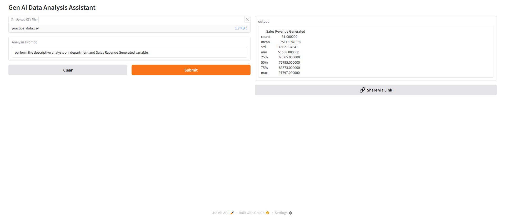

# 📊 Gen AI Data Analysis Assistant

An AI-powered tool that allows users to upload CSV datasets and perform data analysis using **natural language prompts**. It automatically interprets queries and generates insights such as statistics, correlation, and regression.

---

## 🚀 Live Demo
👉   https://huggingface.co/spaces/Navneetpal09/Gen_AI_Data_Analysis_Assistant  

---

## 📸 Screenshot

---

## ✨ Features
- 📂 Upload CSV datasets  
- 💬 Ask questions in plain English  
- 🧠 AI-based prompt understanding  
- 📊 Perform:
  - Descriptive Statistics  
  - Correlation Analysis  
  - Regression Analysis  
- ⚡ Interactive interface using Gradio  

---

## 🧠 How It Works
1. Upload a CSV file  
2. Enter a query (e.g., *“Find correlation between age and salary”*)  
3. The system:
   - Classifies the query  
   - Extracts variables  
   - Matches them with dataset columns  
   - Performs the analysis  
4. Displays results instantly  

---

## 🛠️ Tech Stack
- Python  
- Pandas  
- Scikit-learn  
- Transformers (Hugging Face)  
- spaCy  
- Gradio  

---

## 📦 Installation

git clone https://github.com/Navneet1135/Gen_AI_Data_Analysis_Assistant.git  
cd Gen_AI_Data_Analysis_Assistant
pip install -r requirements.txt  

---

## ▶️ Run the App

python app.py  

---

## ⚠️ Note
If needed, install spaCy model:

python -m spacy download en_core_web_sm  

---

## 📌 Example Prompts
- Show statistics of age  
- Find correlation between salary and experience  
- Run regression on sales vs marketing  

---

## ⭐ Support
If you find this useful, give it a star ⭐

---
